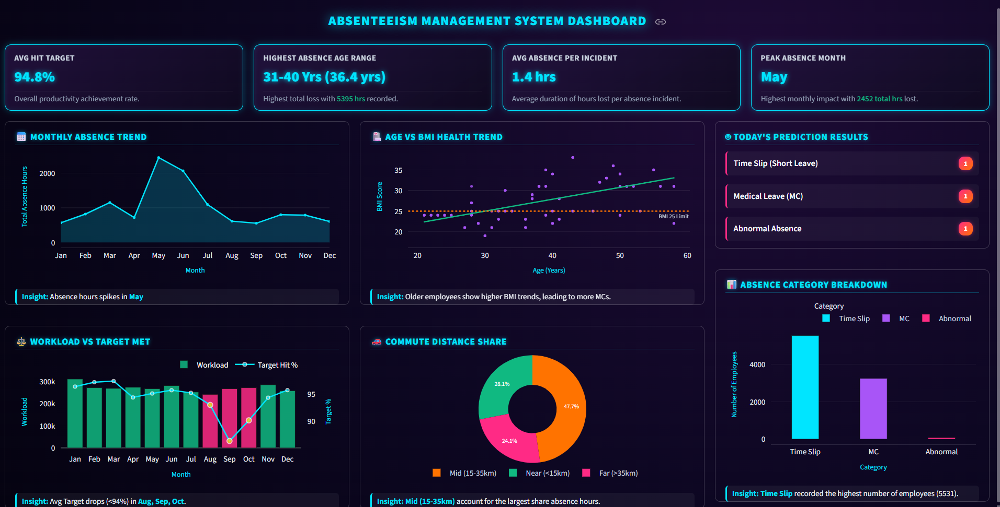

# Absenteeism Management System Dashboard

**Mini DataCamp Hackathon – First Prize (Sep 2026)**

An interactive Streamlit dashboard that helps HR teams understand employee absenteeism and predict absence categories. It shows KPI cards, monthly absence trends, workload against target achievement, health and commute patterns, and daily predictions from a machine learning model.

**Live demo:** [add your Streamlit link here]

> **Note:** The original competition dataset is private. This public version runs on **synthetic data** generated to match the original's column distributions and key patterns (`generate_demo_data.py`). No real record is included, and the numbers in the demo are not the official results.

## Screenshot



## What the project does

- **Data cleaning:** found and replaced missing values (including `#` placeholders) across 17 columns, and grouped absence hours into three classes: Time Slip, Medical Leave (MC) and Abnormal Absence.
- **Prediction:** trained a K-Nearest Neighbours (KNN) classifier, tuned with GridSearchCV, to predict the absence category (Time Slip, MC or Abnormal) of an employee record.
- **Dashboard:** built in Streamlit with Plotly charts, KPI cards and plain-language insight boxes for non-technical HR users.

## Tech stack

Python, Pandas, NumPy, Scikit-learn, Plotly, Streamlit

## Project structure

```
app.py                  # Streamlit dashboard
demo_data.csv           # Synthetic demo data (no real records)
knn_model.pkl           # KNN model trained on the demo data
model_features.pkl      # Feature list used by the model
generate_demo_data.py   # Creates demo_data.csv (needs the private dataset)
train_demo_model.py     # Trains the demo model
notebooks/              # Original data cleaning and prediction notebooks
requirements.txt
```

## Run it locally

```bash
pip install -r requirements.txt
streamlit run app.py
```

To rebuild the demo data and model (requires the private dataset in `data/`):

```bash
python generate_demo_data.py
python train_demo_model.py
```
